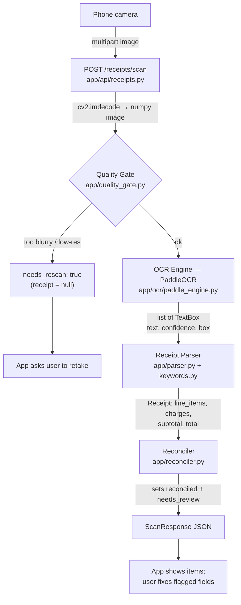
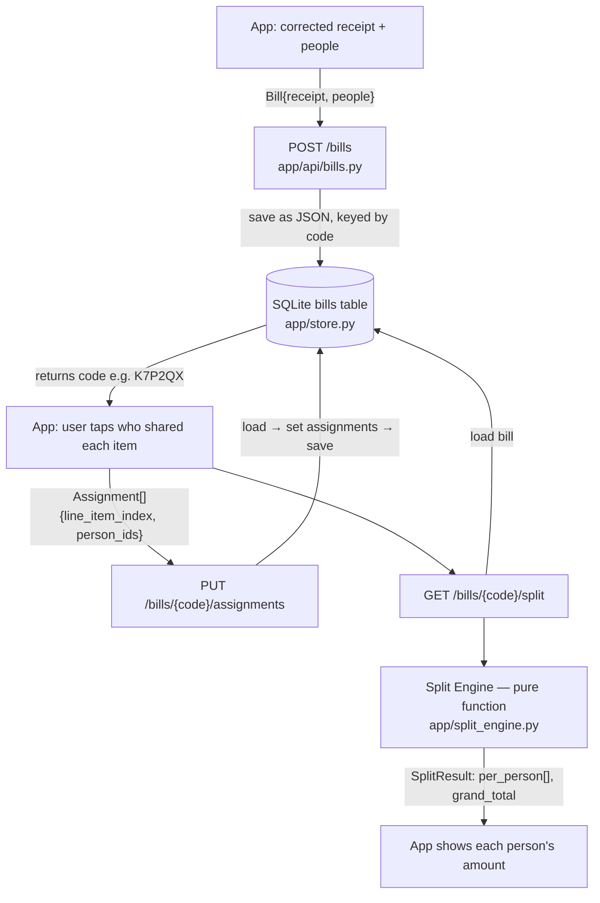

# Split Bill — Data Flow

How data moves through the backend. There are two flows: **extraction** (receipt
photo → structured data) and **splitting** (assignments → who pays what).

Each section has a rendered **Mermaid** diagram (shows on GitHub / most slide
tools) and an **ASCII** version (always readable). File references point at the
component that owns each step.

---

## Flow 1 — Extraction: receipt photo → structured receipt

A stateless request: one image in, one structured receipt out.



ASCII:

```
[Phone camera]
     │  multipart image bytes
     ▼
POST /receipts/scan ......................... app/api/receipts.py
     │  cv2.imdecode → numpy image
     ▼
Quality Gate ................................ app/quality_gate.py
     │  blur + resolution check
     ├─ FAIL → { receipt: null, needs_rescan: true, reason }  ──► "retake photo"
     ▼ PASS
OCR Engine (PaddleOCR) ...................... app/ocr/paddle_engine.py
     │  image → list[TextBox]  (text, confidence, box coords)
     ▼
Receipt Parser ............................. app/parser.py  (+ app/keywords.py)
     │  group boxes into rows/columns, pair name↔price,
     │  classify summary lines (Subtotal/Total/PB1/Service/Diskon)
     │  → Receipt (line_items, charges, subtotal, total)
     ▼
Reconciler ................................. app/reconciler.py
     │  recompute items+charges vs printed total
     │  sets reconciled + needs_review[]
     ▼
ScanResponse → JSON ........ { receipt, needs_rescan, needs_review }
     ▼
[App displays items; user fixes flagged fields]
```

**Transformation chain:** pixels → `list[TextBox]` → `Receipt` → validated `Receipt`.
The OCR engine sits behind an interface (`app/ocr/base.py`), so it can be swapped
without changing anything downstream.

---

## Flow 2 — Splitting: who ate what → who pays what

A stateful flow: the bill is saved in SQLite under a shareable code, so several
people can open the same bill from their own phones.



ASCII:

```
[App: corrected receipt + people]
     ▼
POST /bills ................................ app/api/bills.py
     │  Bill{receipt, people} → BillStore.save()
     ▼
SQLite (bills table) ....................... app/store.py
     │  stored as JSON, keyed by short code (e.g. "K7P2QX")
     │  returns { code }
     ▼
[App: user taps who shared each item]
     ▼
PUT /bills/{code}/assignments .............. load → set assignments → save
     │  Assignment[]{ line_item_index, person_ids[] }
     ▼
GET /bills/{code}/split
     │  load bill from SQLite
     ▼
Split Engine .............................. app/split_engine.py  (pure functions)
     │  • shared items split equally among assignees
     │  • bill discount applied proportionally
     │  • tax/service/rounding allocated proportionally to food,
     │    largest-remainder so shares sum exactly to the total
     ▼
SplitResult → JSON ........ per_person[{ ...total_owed }], grand_total
     ▼
[App shows each person's amount]
```

**Key property:** the Split Engine is a **pure function** —
`(Receipt, people, assignments) → SplitResult`, no I/O — which is why it is
heavily unit-tested and why `sum(total_owed) == grand_total == receipt.total`
exactly, to the Rupiah.

---

## Data objects passed between stages

All defined in [app/models.py](../app/models.py).

```
TextBox            (OCR output: text, confidence, box coords)
   │  parser
   ▼
Receipt            line_items: LineItem[]
                   charges:    Charge[]        (tax_pb1 | service | other)
                   bill_discount: Discount?
                   subtotal, total, reconciled, needs_review[]
   │  + people + assignments
   ▼
Bill               code, receipt, people: Person[], assignments: Assignment[]
   │  split engine
   ▼
SplitResult        per_person: PersonShare[]   (items_subtotal, tax_share,
                   grand_total                  service_share, other_share,
                                                discount_share, total_owed)
```

---

## Two properties worth emphasizing

1. **Fails visibly, never silently.** Bad photos stop at the Quality Gate;
   numbers that don't add up are flagged by the Reconciler (`reconciled: false`,
   `needs_review`). The system never returns a confident-but-wrong total — a
   deliberate choice for a money app.

2. **Stateless extraction, stateful split.** `POST /receipts/scan` is one-shot
   (no storage). The split flow persists the bill in SQLite under a shareable
   `code`, so multiple people can view and split the same bill independently.

See also: [api.md](api.md) (endpoint reference) · [spec.md](spec.md) (design) ·
[plan.md](plan.md) (build plan).
